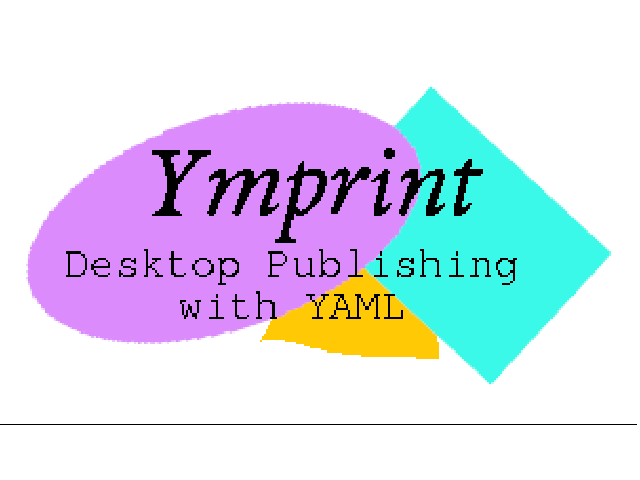

<p align="center">
  
</p>

<h3 align="center">Desktop publishing with YAML</h3>
<p align="center"><em>The technology of the year 2000…today!</em></p>

YMPrint is a Python-based PDF authoring application geared towards professionals who need to
generate lots of PDF documents. You write the content of your report in YAML (as opposed to
Markdown) and YMPrint renders it to PDF with near-instant speeds. YMPrint lets you use Python
scripting within your document, create variables, render variable values, and pass live
Python objects between report **blocks** to create a truly expressive authoring
system—the likes of which have not been created before.

YMPrint is built open the incredible ReportLab library.

```yaml
Site inspection report:
  - >
    This is the first paragraph. The `>` character tells YAML you are entering a
    multi-line string that should be word-wrapped. Leave a blank line to start a
    new paragraph.
  - Findings:
    - Bullets:
      - The handrail is loose on the north stair.
      - Two ceiling tiles are water-stained in the lobby.
    - Items observed:
      - Item Number: 12.01
        Description: There is a problem here. This report documents it.
        Location: Under the stairs
```

```bash
ym convert report.yml
# ✍️ .... 📝 ... PDF created: report.pdf
```

## Why YMPrint?

- **Readable source.** Your document *is* the outline. YAML nesting is the document
  hierarchy — no markup soup, no LaTeX, no HTML.
- **Batteries included.** Bundled fonts, sensible default styles, and a set of blocks for
  the content markdown can't express.
- **Dynamic content.** Interpolate variables with Jinja, execute `_py` blocks, load JSON,
  embed matplotlib figures, and auto-fill PDF form fields.
- **Custom templates.** Overlay your document onto a designed PDF background and
  auto-populate its form fields from document variables.

## Installation

Requires **Python 3.14+**.

```bash
# With uv (recommended) — installs the `ym` command
uv tool install ymprint

# Or with pip
pip install ymprint
```

From source:

```bash
git clone https://github.com/StructuralPython/yamlreports.git
cd yamlreports
uv sync
uv run ym --help
```

## Usage

YMPrint installs a single command, `ym`, with two subcommands.

### `ym convert` — render once

```bash
ym convert report.yml               # writes report.pdf next to the source
ym convert report.yml out/doc.pdf   # choose an output path
```

### `ym live` — hot-reload preview

Renders the PDF, opens it in the [Okular](https://okular.kde.org/) viewer, and rebuilds on
every save. Great for drafting.

```bash
ym live report.yml
```

## Core concepts

- **Keys are headings.** A mapping key whose value is content becomes a heading; the value
  is laid out underneath it. Lists render in order, lists of mappings render as tables.
- **Configuration** lives in underscore-prefixed front matter — `_doc` (page template),
  `_style` (text styles), and `_tablestyle` (table styles) — resolved across three
  inheriting priority levels: internal defaults → project config → document front matter.
- **Variables** are defined in `_vars`, interpolated into text with Jinja (`{{name}}`), and
  passed as real Python objects into blocks with the `$name` syntax.
- **Blocks** are underscore-prefixed keys that expand into custom content:

  | Block | Purpose |
  | --- | --- |
  | `_img` | Embed an image with a caption |
  | `_matplotfig` | Embed a matplotlib figure |
  | `_info` / `_warning` / `_danger` / `_tip` / `_note` | Admonition callouts |
  | `_blockquote` | A quotation with attribution |
  | `_code` | A non-executable, syntax-highlighted code block |
  | `_py` | Execute Python and optionally show the source |
  | `_loadjson` | Load variables from a JSON file |
  | `_pagebreak` | Force a page break |
  | `_hrule` | A configurable horizontal rule |
  | `_spacer` | Insert vertical whitespace |

## Examples

The [`Examples/`](Examples) directory contains a runnable report for each major feature —
a simple document, document configuration, variables, PDF backgrounds, Python execution,
and the full set of blocks. Render any of them with `ym convert`.

## Documentation

The full documentation site lives in [`docs/`](docs) (Sphinx + the Shibuya theme). Build it
locally with:

```bash
uv run --with-requirements docs/requirements.txt \
    sphinx-build -b html docs docs/_build/html
```

Then open `docs/_build/html/index.html`. See [`docs/README.md`](docs/README.md) for details.

## License

See [LICENSE](LICENSE).
