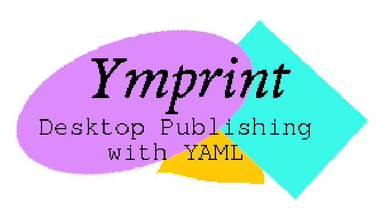

# YMPrint

<div class="ym-hero">



<p class="ym-tagline">Desktop publishing with YAML</p>

<p class="ym-subtagline">The technology of the year 2000&hellip;today!</p>

</div>

**YMPrint** is a Python-based PDF authoring application geared towards professionals who need
to generate lots of PDF documents. You write the content of your report in YAML (as opposed
to Markdown) and YMPrint renders it to PDF with near-instant speeds. YMPrint lets you use
Python scripting within your document, create variables, render variable values, and pass
live Python objects between report **blocks** to create a truly expressive authoring
system&mdash;the likes of which have not been created before.

```yaml
Report title:
  - >
    Here is the first paragraph. Word-wrapped, styled, and typeset
    straight from YAML — no LaTeX, no HTML, no page-layout software.
  - Sub-heading: >
      Nest a heading under a paragraph by turning the list item into
      a key/value pair. The key becomes the heading.
  - Standard content types:
    - Bullets:
      - Bullet 1
      - Bullet 2
    - Tables:
      - Item: 12.01
        Location: Under the stairs
```

```bash
ym convert report.yml
# ✍️ .... 📝 ... PDF created: report.pdf
```

::::{grid} 1 1 2 2
:gutter: 3

:::{grid-item-card} 🚀 Quickstart
:link: quickstart
:link-type: doc

Install YMPrint and render your first PDF in a couple of minutes.
:::

:::{grid-item-card} 🖼️ Examples
:link: examples
:link-type: doc

A gallery of runnable reports with their rendered-PDF previews.
:::

:::{grid-item-card} 📄 Document structure
:link: guide/document-structure
:link-type: doc

How headings, paragraphs, bullets, ordered lists, and tables map onto YAML.
:::

:::{grid-item-card} 🧱 Blocks
:link: reference/blocks
:link-type: doc

Images, admonitions, code, quotes, spacers, rules, figures, and Python.
:::

:::{grid-item-card} 🎨 Configuration
:link: guide/configuration
:link-type: doc

Control page templates, text styles, and table styles across three priority levels.
:::

:::{grid-item-card} 🔢 Variables
:link: guide/variables
:link-type: doc

Define `_vars`, render them with Jinja, and pass Python objects into blocks.
:::

:::{grid-item-card} ⌨️ CLI
:link: reference/cli
:link-type: doc

`ym convert` and `ym live` — one-shot rendering and hot-reload preview.
:::

::::

## Why YMPrint?

- **Readable source.** Your document *is* the outline. YAML nesting is the document
  hierarchy — no markup soup.
- **Batteries included.** Bundled fonts, sensible default styles, and a set of blocks
  for the content markdown can't express.
- **Dynamic content.** Interpolate `_vars` with Jinja, execute `_py` blocks, load JSON,
  embed matplotlib figures, and auto-fill PDF form fields.
- **Custom templates.** Overlay your document onto a designed PDF background and
  auto-populate its form fields from document variables.

```{toctree}
:hidden:
:caption: Getting started

installation
quickstart
examples
```

```{toctree}
:hidden:
:caption: Guides

guide/document-structure
guide/configuration
guide/variables
guide/pdf-backgrounds
```

```{toctree}
:hidden:
:caption: Reference

reference/blocks
reference/cli
reference/fonts
```
